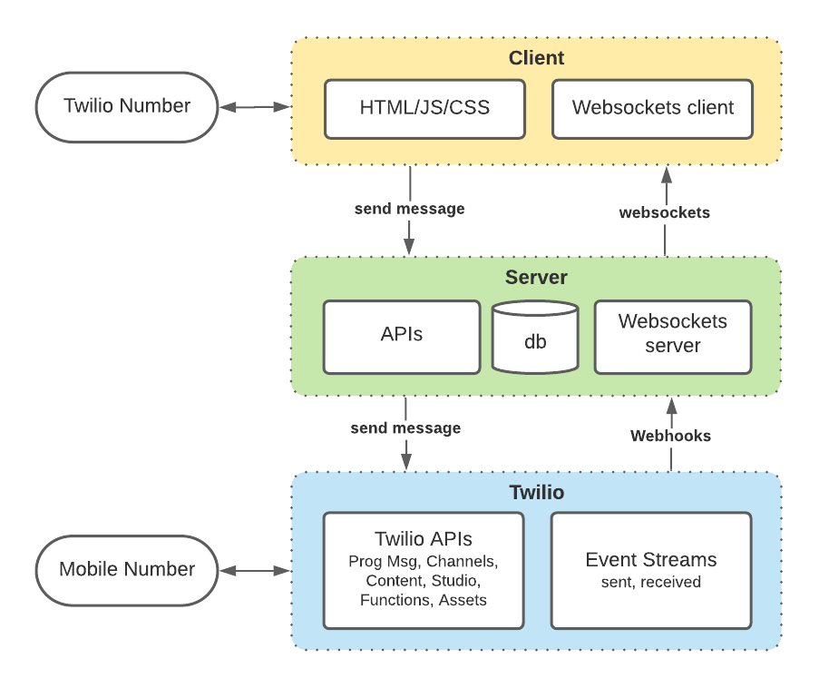

# Twilio Widget

## Features left to implement

| Feature                        | Description                                                                                                                                                                                                                                                                                               | Who  |
| ------------------------------ | --------------------------------------------------------------------------------------------------------------------------------------------------------------------------------------------------------------------------------------------------------------------------------------------------------- | ---- |
| FB Messenger                   | Support Facebook Messenger Channel                                                                                                                                                                                                                                                                        | John |
| API Key/Secret                 | Use API Key and Secret rather than Acct SID and Auth Token                                                                                                                                                                                                                                                | John |
| Deploy to heroku button        | One-click deploy to heroku button on github repo                                                                                                                                                                                                                                                          | John |
| Architecture Diagram           | Create diagram explaining the architecture and APIs used                                                                                                                                                                                                                                                  | John |
| Presentation/Video             | Create submission presentation and video                                                                                                                                                                                                                                                                  | John |
| Play Sound on event            | [Play a sound](https://www.w3schools.com/jsref/met_audio_play.asp) when a message is sent or received. For example: on conversationUpdated() event, play G if unread_count > 0, play C if unread_count = 0.                                                                                               | ?    |
| Code Exchange One-Click Deploy | One-click deploy to Heroku on Twilio Code Exchange                                                                                                                                                                                                                                                        | ?    |
| Outgoing MMS                   | Upload/send MMS images (already supports receiving/displaying MMS images) and store on [Twilio Assets](https://www.twilio.com/docs/runtime/assets)                                                                                                                                                        | ?    |
| Authentication                 | Authenticate users (via [Basic Auth](https://javascript.plainenglish.io/add-basic-authentication-to-an-express-app-9536f5095e88)?) and associate with Twilio Acct phone number                                                                                                                            | ?    |
| Templates                      | Ability to insert canned templates with variable using Twilio [Content API](https://docs.google.com/document/d/1DqgGYs3A_EDXZhnfRAspRcxYv7jcvyAfReVi9bk1Shw/edit#) Pilot. We will need to set an account flag (in Monkey?) called `api.messaging.rich-content` on each of our accounts in order to use it | ?    |
| Auto-Replies?                  | Webhook after-hour auto-replies                                                                                                                                                                                                                                                                           | ?    |
| Keywords?                      | Webhook keyword auto-replies                                                                                                                                                                                                                                                                              | ?    |
| Mobile Responsive?             | Collapse sidepanel when running on mobile device                                                                                                                                                                                                                                                          | ?    |
| Chrome Extension?              | Display T icon next to phone numbers on any page, launch Widget when clicked                                                                                                                                                                                                                              | ?    |
| Twilio Node SDK?               | Consider replacing Fetch API calls with Twilio Node SDK                                                                                                                                                                                                                                                   | ?    |

## How it works

This app creates a Zipwhip-like interface for a Twilio phone number to send/receive text messages to/from a mobile phone. It uses the Twilio Programmable Messaging API to send messages via SMS, MMS, WhatsApp and Facebook Messenger; Twilio Event Streams Webhooks for incoming/outgoing messages; Websockets for real-time communicate with the web clients; Twilio Functions/Assets for hosting MMS images, Twilio Content API for Templates; Twilio Verify(?) for authentication.

You can run locally or deploy to heroku.

## Features

- Chat client built in vanilla html/javascript based on this [Codepen sample UI](https://codepen.io/sajadhsm/pen/odaBdd)
- Chat client sends text messages (SMS & MMS) via Twilio Programmable Messaging API
- Chat client supports WhatsApp and Facebook Messenger via Twilio Channels API
- Chat client connects to [Websocket](https://npm.im/ws) server to receive messages
- Express server receives Twilio Event Streams Webhooks for incoming and outgoing text messages
- Express server forwards Webhook messages to Websocket server
- Websocket server broadcasts messages to chat clients
- One click deploy button for [Heroku](https://heroku.com)



## Set up

### Requirements

- [Node.js](https://nodejs.org/)
- [Twilio account](https://twilio.com)
- [Postgresql](https://wiki.postgresql.org/wiki/Homebrew)

### Local development

After the above requirements have been met:

1.  Clone this repository and `cd` into it

    ```bash
    git clone git@github.com:johnchaffee/twilio-widget.git
    cd twilio-widget
    ```

2.  Install dependencies

    ```bash
    npm install
    ```

3.  Create a `.env` file in your root directory and enter the environment variables below.

    ```
    PORT=3000
    NODE_ENV=development
    APP_HOST_NAME=localhost
    TWILIO_NUMBER=<Your Twilio Phone Number>
    TWILIO_ACCOUNT_SID=<Your Twilio Account SID>
    TWILIO_AUTH_TOKEN=<Your Twilio Auth Token>
    FACEBOOK_MESSENGER_ID=<Your messenger ID>
    WHATSAPP_ID=<Your WhatsApp ID>
    LIMIT=20
    ```

4.  Run the application

    ```bash
    npm start
    ```

    Your application is now accessible at [http://localhost:3000](http://localhost:3000/)

5.  Make the application visible to the outside world.

    Your application needs to be accessible at a public internet address for Webhooks to be able to connect with it. You can do that in different ways, deploying the app to [heroku](https://devcenter.heroku.com/articles/getting-started-with-nodejs?singlepage=true) or using [ngrok](https://ngrok.com/) to create a tunnel to your local server.

    If you have ngrok installed, you can open a tunnel to your local server by running the following command:

    ```
    ngrok http 3000
    ```

    Now your application should be available at a url like:

    ```
    https://<unique_id>.ngrok.io/
    ```

6.  Create [Event Streams](https://www.twilio.com/docs/events) webhook for incoming and outgoing messages. You'll need to point it to the ngrok and/or heroku url above.

_NOTE: There is a bug in Event Streams where it won't send inbound webhooks unless you configure a default incoming webhook for your Twilio Phone Number in Twilio Console > Phone Numbers > Manage > Active Numbers > PHONE_NUMBER. On the bottom of the page in the Messaging section where it says A MESSAGE COMES IN, select Webhook from the popup and enter a URL. The URL does not have to be your actual ngrok endpoint, just any valid URL. I entered `https://example.com` and that fixed the problem. We need to inform the Event Streams team about this bug..._

Create a sink endpoint:

```
twilio api:events:v1:sinks:create --description "twilio-widget.herokuapp.com webhooks" \
--sink-configuration '{"destination":"https://twilio-widget.herokuapp.com/twilio-event-streams","method":"POST","batch_events":false}' \
--sink-type webhook
```

Subscribe to `sent` and `received` messages using the SID returned from above:

```
twilio api:events:v1:subscriptions:create \
  --description "Subscribe to 'sent' and 'received' messaging events" \
  --sink-sid <EVENT STREAM SID> \
  --types '{"type":"com.twilio.messaging.message.sent","schema_version":1}' \
  --types '{"type":"com.twilio.messaging.inbound-message.received","schema_version":1}'
```

That's it! Now you can start sending and receiving messages text messages in the web client.

## WhatsApp

In addition to SMS and MMS, you can send/receive messages with WhatsApp users. You can use the Twilio Sandbox for WhatsApp to prototype with WhatsApp immediately, without waiting for your Twilio number to be approved for WhatsApp. You can configure the Twilio WhatsApp Sandbox for your account in the [Twilio Console](https://console.twilio.com/us1/develop/sms/settings/whatsapp-sandbox?frameUrl=%2Fconsole%2Fsms%2Fwhatsapp%2Fsandbox%3Fx-target-region%3Dus1).

Once you've done that, you can join the sandbox by sending a WhatsApp message from your mobile device to \<your Twilio WhatsApp Number> with your \<Twilio Sandbox code> provided when setting up the account in the Console. You will then be able to send/receive messages between the Widget and WhatsApp.

For best results, the conversation should be initiated by the WhatsApp user on their mobile device. Then you can send any message you want to the WhatsApp user for a period of 24 hours since the last message received.

If you want to initiate a conversation with a WhatsApp user, it must be using one of the following pre-approved outgoing templates for WhatsApp:

- Your {{1}} code is {{2}}
- Your {{1}} appointment is coming up on {{2}}
- Your {{1}} order of {{2}} has shipped and should be delivered on {{3}}. Details : {{4}}

## Data Model

There are two database tables. One table stores a list of all the conversations that are displayed in the Conversations sidebar, and one that stores a list of all the inbound and outbound messages that are displayed in the Messages section.

### conversations table

The `conversations_id` is unique and concats the twilio number and mobile number separated by a semicolon.

```
 id |conversation_id            |       date_updated       |     name     | unread_count
----+---------------------------+--------------------------+--------------+-------------
 53 | +18555080989;+12063996576 | 2021-11-16T23:27:23.000Z | John Chaffee | 2
 54 | +18555080989;+12063693826 | 2021-11-16T23:27:23.000Z | Lani Gray    | 0
```

```json
[
  {
    "conversation_id": "+18555080989;+12063996576",
    "date_updated": "2021-11-16T23:27:23.000Z",
    "name": "John Chaffee",
    "unread_count": 2
  }
]
```

### messages table

The messages table always stores the `twilio_number` and `mobile_number` in the same column and indicates whether a message was `outbound` or `inbound` with the `direction` column. This allows you to fetch all inbound and outbound messages between a twilio number and mobile number with a single request.

```
 id | conversation_id           | twilio_number | mobile_number |       date_created       | direction | body
----+---------------------------+---------------+---------------+--------------------------+------------------------------
 53 | +18555080989;+12063996576 | +18555080989  | +12063996576  | 2021-11-16T23:27:23.000Z | outbound  | hey, how's it going?
 54 | +18555080989;+12063996576 | +18555080989  | +12063996576  | 2021-11-16T23:27:34.000Z | inbound   | pretty good. how are you?
 55 | +18555080989;+12063996576 | +18555080989  | +12063996576  | 2021-11-16T23:27:40.000Z | outbound  | I'm fine. Thanks for asking.
```

```json
[
  {
    "conversation_id": "+18555080989;+12063996576",
    "dateCreated": "2021-11-14T22:34:13.204Z",
    "direction": "outbound",
    "twilio_number": "+18555080989",
    "mobile_number": "+12063996576",
    "body": "hey, how's it going?"
  }
]
```

## Configure Postgres database on localhost

```sql

-- launch postgres
psql postgres

-- List databases
postgres-# \l

                                         List of databases
          Name           |  Owner   | Encoding |   Collate   |    Ctype    |   Access privileges
-------------------------+----------+----------+-------------+-------------+-----------------------
 api                     | me       | UTF8     | en_US.UTF-8 | en_US.UTF-8 |
 node_getting_started    | jchaffee | UTF8     | en_US.UTF-8 | en_US.UTF-8 |
 postgres                | jchaffee | UTF8     | en_US.UTF-8 | en_US.UTF-8 |
(3 rows)

-- Create widget database
CREATE DATABASE widget;

-- Connect to widget database
\c widget;

-- Create messages table
CREATE TABLE messages (
  ID SERIAL PRIMARY KEY,
  date_created VARCHAR(30),
  direction VARCHAR(10),
  twilio_number VARCHAR(40),
  mobile_number VARCHAR(40),
  conversation_id VARCHAR,
  body text,
  media_url VARCHAR
);

-- Create a sample message
INSERT INTO messages (date_created, direction, twilio_number, mobile_number, conversation_id, body)
  VALUES ('2021-11-14T22:34:13.204Z', 'outbound', '+18555080989', '+12063996576', '+18555080989;+12063996576', 'Outgoing message'), ('2021-11-14T22:34:17.934Z', 'inbound', '+18555080989', '+12063996576', '+18555080989;+12063996576', 'Reply from mobile');

-- Fetch all messages
SELECT * FROM messages order by date_created desc;

 id  |       date_created       | direction | twilio_number | mobile_number |        body         |    conversation_id
-----+--------------------------+-----------+---------------+---------------+---------------------+--------------------------
 205 | 2021-11-18T22:14:00.000Z | outbound  | +18555080989  | +12063996576  | Reply from mobile   | +18555080989;+12063996576
 207 | 2021-11-18T22:18:14.000Z | outbound  | +18555080989  | +12063996576  | Outgoing message    | +18555080989;+12063996576


-- Create conversations table
CREATE TABLE conversations (
  ID SERIAL PRIMARY KEY,
  date_updated VARCHAR(30),
  conversation_id VARCHAR UNIQUE,
  contact_name VARCHAR,
  unread_count SMALLINT,
  status VARCHAR(10),
);

-- Create conversation
INSERT INTO conversations (date_updated, conversation_id, contact_name, unread_count)
  VALUES ('2021-11-14T22:34:13.204Z', '+18555080989;+12063996576', 'John Chaffee', 2, 'open'), ('2021-11-14T22:35:14.204Z', '+18555080989;+12063693826', 'Lani Chaffee', 0, 'open');

-- Fetch all conversations
SELECT * FROM conversations order by date_updated desc;

 id |     date_updated         |      conversation_id      | contact_name | unread_count | status
----+--------------------------+---------------------------+--------------+--------------+--------
  2 | 2021-11-14T22:35:14.204Z | +18555080989;+12063693826 | Lani Chaffee |            0 | open
  1 | 2021-11-14T22:34:13.204Z | +18555080989;+12063996576 | John Chaffee |            2 | open

-- Sample db config change examples to help in the future
ALTER TABLE messages RENAME COLUMN mobile TO mobile_number;
ALTER TABLE messages ADD COLUMN conversation_id VARCHAR;
ALTER TABLE conversations ADD UNIQUE (conversation_id);
ALTER TABLE conversations RENAME COLUMN updated_at TO date_updated;
ALTER TABLE conversations ADD COLUMN status VARCHAR(10);
DELETE FROM conversations WHERE id = 3;
```

## Configure Postgres database on heroku

Connect to the heroku postgres db using the heroku CLI command below, then run all the same database operations as above.

```sql
-- Connect to heroku postgres
heroku pg:psql
--> Connecting to postgresql-crystalline-12737
```

## Cloud deployment - TODO

As an alternative to running the app locally, you can deploy it to heroku by clicking the button below.

<a href="https://heroku.com/deploy?template=https://github.com/johnchaffee/twilio-widget">
  
</a>

Note: When deploying to heroku, you will be prompted to enter several environment variables as described below.

- `APP_HOST_NAME` - The subdomain for your app on heroku. For example, enter `my-cool-app` to create an app hosted at `https://my-cool-app.herokuapp.com`.
- `MOBILE` - A default mobile phone number to send messages to in E.164 format (e.g. `+12065551212`).
- `TWILIO_NUMBER` - Your Twilio phone number to send messages from in E.164 format (e.g. `+12065551212`).
- `TWILIO_ACCOUNT_SID`
- `TWILIO_AUTH_TOKEN`
